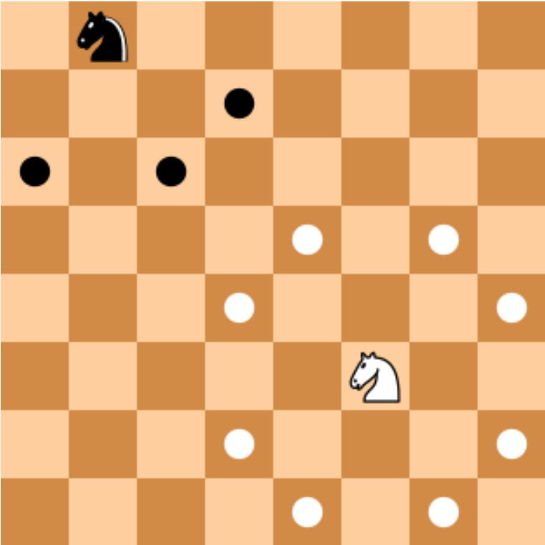

#### 💯Points: 

#### 📝 [Report](../../blob/badges/report.md)
---

# Linear Temporal Logic and Model Checking

## Task 1: Natural Language and LTL

This task is about the translation of natural language (NL) text into LTL and vice versa.

For each bullet below create an LTL formula using at least the operators mentioned in the specification (in any order) and include a NL text for the meaning of the LTL formula. Use the syntax of NuSMV.

The formulas and NL requirements must be formulated for a robotic system. Note that the analysis will likely generate counterexamples as transitions in the model are unrestricted:

a.  https://play.formal-methods.net/?check=XMV&p=chomp-bleach-capped-curdle

b. https://play.formal-methods.net/?check=XMV&p=ovary-thirty-slept-maimed

c. https://play.formal-methods.net/?check=XMV&p=spleen-frozen-prone-ashy

**Submission**: Submit each permalink in- [src/main/java/de/buw/fm4se/modelchecking/task/Tasks.java (task_1a-c)](src/main/java/de/buw/fm4se/modelchecking/task/Tasks.java)

## Task 2: Semantic Relations

Use a single NuSMV module for each pair in this task. For each pair of formulas provide a total of three checks to analyze whether the first implies the second, whether the second implies the first, and whether they are equivalent.

a. https://play.formal-methods.net/?check=XMV&p=grape-bucket-shock-tabby (note: the release operator “R” from the slides has syntax “V” in NuSMV)
  
b. https://play.formal-methods.net/?check=XMV&p=letter-womb-crumb-poplar
  
c. https://play.formal-methods.net/?check=XMV&p=antics-mango-eatery-props
  
**Submission**: Submit the permalink in- [src/main/java/de/buw/fm4se/modelchecking/task/Tasks.java (task_2a-c)](src/main/java/de/buw/fm4se/modelchecking/task/Tasks.java)

## Task 3: Train Signals

Analyze the given specifications using NuSMV. The files model a rail crossing.

For each violated LTL specification copy the counterexample and explain in your own words, why the property is violated. Note that we will check the explanation manually, i.e., it is not checked by the test cases.

a. https://play.formal-methods.net/?check=XMV&p=stunt-credit-retold-lavish

b. https://play.formal-methods.net?check=XMV&p=rosy-parish-bronco-palm

**Submission**: Submit as text inside file [src/resources/task3a.txt](src/resources/task3a.txt) and [src/resources/task3b.txt](src/resources/task3b.txt)

## Task 4: Knight Moves

Create an SMV module to encode the moves of a knight on an 8x8 chess board. The knight always starts at coordinate (0, 1).

Knights can move as illustrated below (see this article or any other source https://en.wikipedia.org/wiki/Knight_(chess)).

Start from this template: https://play.formal-methods.net/?check=XMV&p=caring-snout-award-snare

  
**Submission**: Submit the permalink in- [src/main/java/de/buw/fm4se/modelchecking/task/Tasks.java (task_4)](src/main/java/de/buw/fm4se/modelchecking/task/Tasks.java)
